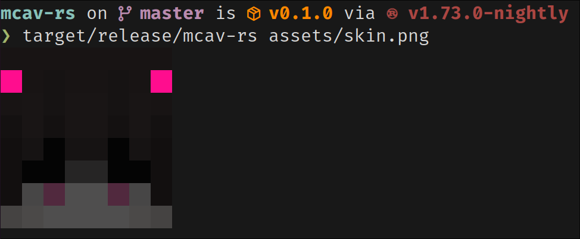

# mcav-rs

Prints a Minecraft avatar from a skin in the terminal.

## Demo



## Quick Start

```sh
$ cargo build --release
$ target/release/mcav-rs assets/skin.png
```

## License

This project is under the [MIT](./LICENSE) License.
