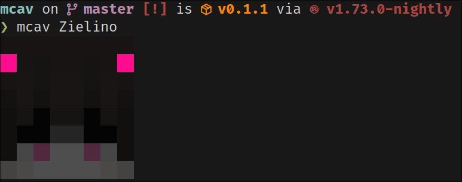

# mcav-rs

Prints a Minecraft avatar from a skin in the terminal.

## Demo



## Quick Start

Build:
```sh
$ cargo build --release
```

Use:
```sh
# Normal scale
$ target/release/mcav <username>
# Custom scale
$ target/release/mcav <username> 2
```

## License

This project is under the [MIT](./LICENSE) License.
